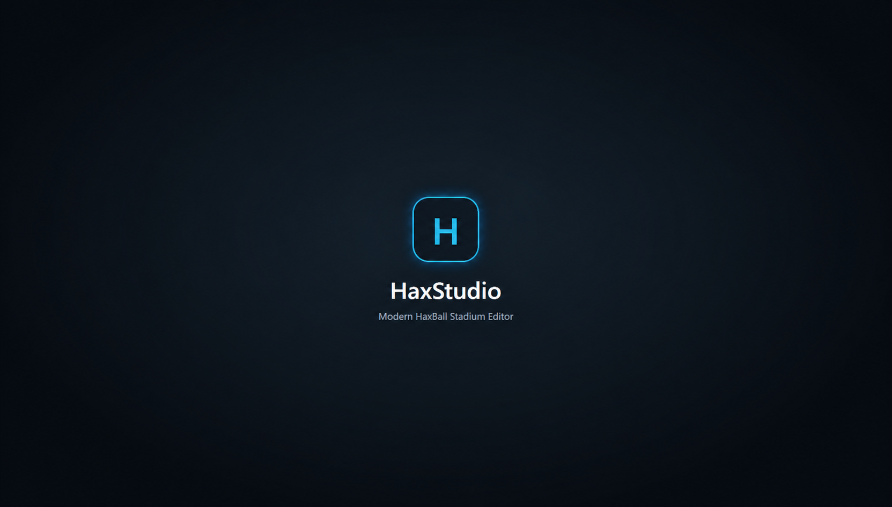
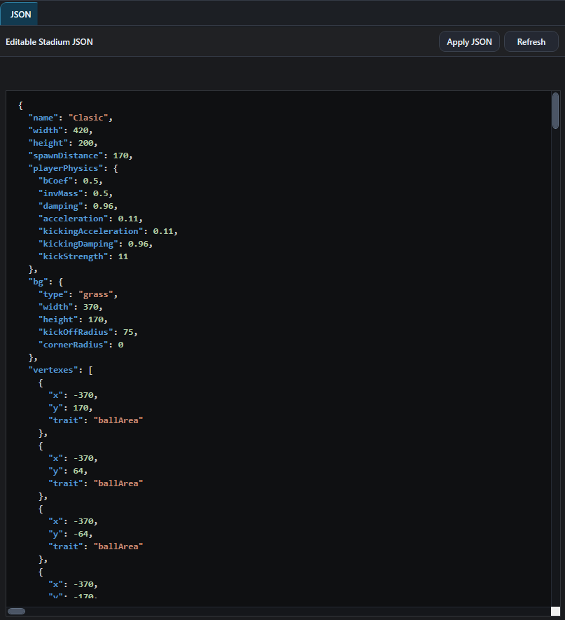
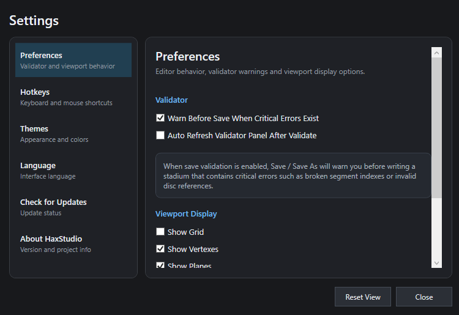
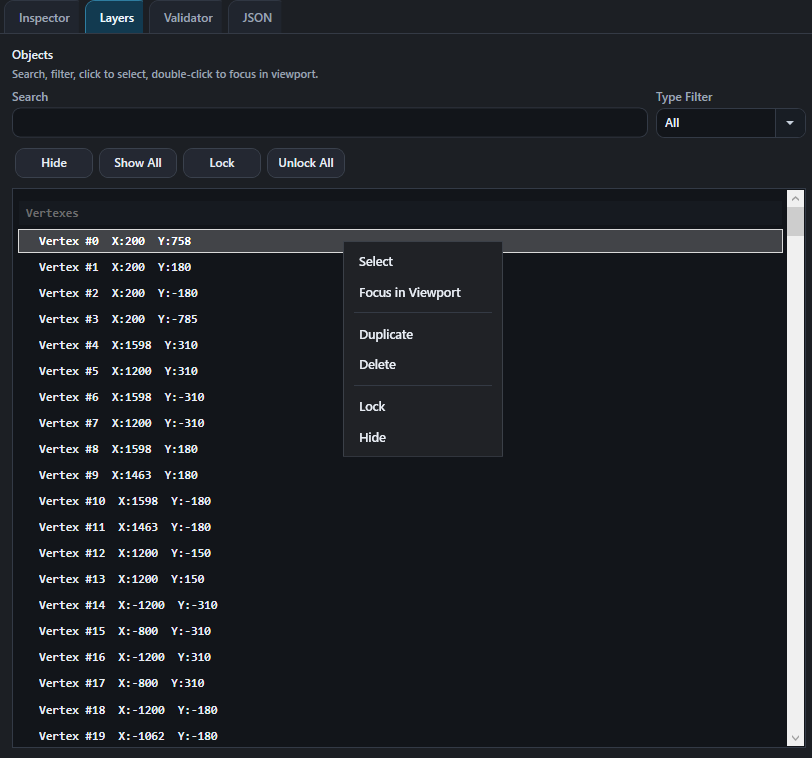
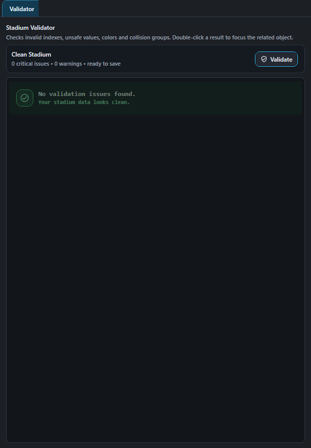

# HaxStudio

**HaxStudio** is a modern native Windows desktop editor for creating and editing HaxBall `.hbs` stadium files.

Built with **WPF / C#**, HaxStudio focuses on visual stadium editing, advanced map workflows, multi-renderer viewport performance, decorative segment generation, image-to-segment importing, validation, safer saving, cleanup tools, and a professional workflow for HaxBall stadium creators.

> Status: Public release / v1.4.0

---

## Preview



---

## Overview

HaxStudio is designed to make HaxBall stadium editing easier, safer, faster, and more visual.

Instead of editing `.hbs` JSON files manually, users can open a stadium file, inspect objects, edit the map visually, generate decorative content, validate the stadium, and save the result back as a valid `.hbs` file.

The project aims to provide a modern editor experience while preserving important HaxBall stadium data from real maps. HaxStudio is especially useful for advanced maps that are difficult to manage in browser-based editors, including maps with many joints, discs, curves, moving segment systems, decorative logos, dense object layouts, generated text, and imported image outlines.

---

## Screenshots

### Main Editor


### JSON Editor



### Settings



### Layers Panel



### Validator



---

## Key Features in v1.4.0

### Multi-Renderer Viewport System

HaxStudio now includes a complete multi-renderer system for better performance and compatibility.

Available renderers:

- Canvas fallback renderer
- Direct2D renderer
- OpenGL renderer
- Vulkan renderer

Renderer features:

- Renderer selection at the top of Preferences
- Automatic renderer setting save support
- Clean viewport renderer badge showing the active renderer
- Real-time render ms updates for all renderers
- Warning when switching renderer while a stadium is open
- Improved consistency across Canvas, Direct2D, OpenGL, and Vulkan

### Text to Segments

HaxStudio can generate real HaxBall segments from text.

- Uppercase letter support
- Lowercase letter support
- Adjustable text size
- Adjustable segment color
- Click-and-drag placement inside the viewport
- Automatically selects generated text after placement
- Decorative / no-collision output by default

This makes it easier to add names, titles, labels, server branding, logos, and decorative text directly into `.hbs` maps.

### Insert Shape

HaxStudio includes a preset shape generator under the Tools menu.

Available categories:

- Basic
- Symbols
- Objects

Included preset shapes:

- Star
- Heart
- Triangle
- Square
- Circle
- Diamond
- Pentagon
- Hexagon
- Octagon
- Rounded Rectangle
- Ring
- Spiral
- Wave Line
- Zigzag Line
- Plus
- Minus
- X Cross
- Check Mark
- Exclamation
- Question Mark
- Lightning
- Fire
- Sun
- Crescent Moon
- Target
- Flower
- Eye
- Skull
- Sword
- Anchor
- Arrow
- Play Button
- Pause Button
- Shield
- Crown
- House
- Flag
- Trophy
- Medal
- Key
- Lock
- Gear
- Bell
- Book
- Camera
- Music Note
- Cloud
- Tree
- Leaf

All inserted shapes are generated as real HaxBall segments and are decorative / no-collision by default.

### Shape Placement System

Generated shapes now use a controlled placement workflow.

- Select a shape from Tools > Insert Shape
- A preview box appears in the viewport
- Click or drag the preview box to place it on the map
- The created shape is automatically selected
- Press Escape to cancel placement

This makes preset shape placement more predictable and easier to control.

### Import Image as Segments (BETA)

HaxStudio includes an experimental image-to-segment converter.

Supported formats:

- PNG
- JPG
- BMP

Best suited for:

- Logos
- Icons
- Simple shapes
- Transparent PNG images
- High-contrast images
- Solid-background images

Features:

- Converts image outlines into real HaxBall segments
- Automatic outline tracing
- Polygon simplification
- Straight-edge cleanup
- HaxBall vertex/segment limit protection
- Vertex reuse where possible
- Click-and-drag placement inside the viewport
- Decorative / no-collision output by default

This feature is marked as **BETA** because complex images may still require manual cleanup after import.

### Move Tool

HaxStudio now includes a dedicated Move tool next to Select in the toolbar.

- Select one or more objects
- Switch to Move mode
- Drag the selected objects directly in the viewport
- Useful for generated text, preset shapes, imported image outlines, logos, and grouped stadium objects

Hotkey:

| Shortcut | Action |
|---|---|
| Ctrl + Shift + M | Move Tool |

### Cross-map Copy / Paste

HaxStudio supports copying selected stadium objects from one map and pasting them into another map.

- Copy objects from one `.hbs` stadium and paste them into another
- Correctly remaps segment vertex references during paste
- Automatically includes connected vertexes when copying segments
- Automatically includes connected discs when copying joints
- Handles copied trait data more safely
- Useful for moving logos, decorations, patterns, and reusable stadium parts between maps

### Paste Capacity and HaxBall Limit Checks

HaxStudio helps prevent pasted objects from creating stadiums that HaxBall cannot load.

- Paste capacity preview before inserting copied objects
- Shows current object counts and paste cost
- Warns when paste would exceed HaxBall object/index limits
- Helps avoid broken exports caused by too many vertexes, segments, discs, or joints
- Better status messages after copy and paste operations

### Safer HaxBall Compatibility Validator

The validator is designed to be practical for real community maps.

- Critical issues are reserved for problems that can realistically prevent HaxBall from loading a stadium
- Many previously strict checks are Warning or Info
- Clearer HaxBall compatibility status
- Better distinction between invalid stadium data and mapper-intended unusual data
- Practical validation for real `.hbs` files

### Safe Export Report

Saving and exporting provides a clearer compatibility summary.

- Export completion report
- HaxBall compatibility status
- Object count summary
- Validator summary
- Helps users understand whether the exported map is likely to open in HaxBall

### Selection Statistics

The selection information panel gives useful data for selected objects and object groups.

- Selected object counts
- Multi-selection bounds
- Selection width and height
- Paste cost information
- Helpful when selecting logos or dense object groups

### Cleanup Tools

HaxStudio includes safe cleanup tools for common stadium issues.

- Cleanup Safe Issues
- Remove Unused Vertexes
- Remove Unused Traits
- Safer cleanup for invalid or unnecessary data
- Helps reduce clutter before export

### Measure Tool Upgrades

The Measure Tool supports more precise mapping workflows.

- Live coordinate and measurement information
- Distance, delta X, delta Y, and angle display
- Vertex snapping for accurate measurement
- Vertex locking for stable vertex-to-vertex measurements
- Guide/corner snap points to help draw symmetric segments
- Improved measurement overlay information

### Rotation Handle

Selected objects can be rotated directly from the viewport.

- Rotate handle appears near the selected object or multi-selection group
- Drag the handle to rotate selected objects
- Works with single selection and multi-selection
- Useful for logos, patterns, decorative objects, and repeated stadium structures

### Curve and Hitbox Improvements

Curved segment interaction and export safety have been improved.

- More precise curved segment hitboxes
- Better curved segment selection behavior
- Safer handling of curve-related export data
- Preserves important HaxBall curve data more carefully

### Update Checker

HaxStudio includes an update checker that can read the latest release manifest.

- Automatic update check on startup
- Current version display
- Latest version check
- Release notes display
- Release page / installer download support

### Anonymous Usage Analytics Preference

HaxStudio includes an optional anonymous usage analytics preference.

The setting can be turned off anytime in Preferences.

HaxStudio only sends minimal anonymous app usage data:

- App start activity
- App version
- Selected renderer
- Anonymous install ID hash

HaxStudio does **not** send:

- Map files
- Map names
- File paths
- Usernames
- Emails
- Locations
- Discord information
- Personal content

---

## File Management

- Open `.hbs` stadium files
- Save existing stadium files
- Save As support
- New stadium creation
- Recent Files menu
- JSON Apply / Refresh workflow
- Manual JSON edits are applied before saving
- Invalid JSON prevents unsafe save
- Optional save/export validation flow
- Safe export compatibility report
- Preserves important existing stadium data from real maps

---

## Supported Stadium Objects

- Vertexes
- Segments
- Discs
- Goals
- Planes
- Red spawn points
- Blue spawn points
- Joints

---

## Preserved HaxBall Data

HaxStudio is designed to keep important HaxBall stadium fields intact when loading and saving existing maps.

Preserved data includes:

- `traits`
- `trait`
- `cMask`
- `cGroup`
- `playerPhysics`
- `ballPhysics`
- `canBeStored`
- Curve data
- Joint data
- Object extension data
- Unknown / extra JSON fields where supported

---

## Editor Tools

- Modern visual stadium viewport
- Canvas fallback renderer
- Direct2D renderer
- OpenGL renderer
- Vulkan renderer
- HaxPuck-inspired grass background
- Zoom and pan support
- Reset viewport
- Grid display option
- Snap to Grid
- Adjustable grid size
- Adjustable vertex size
- Optional invisible object display
- Optional plane display
- Optional background stripe display
- Segment line and curve rendering
- HaxBall-style arc visualization
- Curve handle editing
- Text to Segments
- Insert Shape
- Import Image as Segments (BETA)
- Move Tool
- Measure Tool with vertex snapping and locking
- Measurement guide/corner snap points
- Overlapping segment selection by repeated clicking
- Viewport mini toolbar
- Viewport rotation handle
- Mirror selected horizontally / vertically
- Auto Mirror placement mode

---

## Selection System

- Click selection
- Ctrl + click multi-selection
- Ctrl + A select all
- Left drag selection for objects fully inside the rectangle
- Right drag selection for objects touched by the rectangle
- Multi-delete
- Drag selected objects
- Dedicated Move tool for dragging selected objects
- Drag multiple selected objects together
- Rotate selected objects from the viewport
- Copy selected object groups
- Paste copied object groups into the same map or another map
- Paste capacity checks
- Clear selection with Escape
- Selected object highlight in viewport
- Selected object highlight in Layers panel
- Selection statistics and bounds information

---

## Inspector

The Inspector panel shows and edits properties for the selected object.

Supported inspector sections include:

- Vertex properties
- Segment properties
- Disc properties
- Goal properties
- Plane properties
- Spawn point properties
- Joint information
- Multi-select common properties
- Selection information panel
- Selection statistics and paste cost information

Editable values include position, radius, color, curve, team, plane normal / distance, collision group, collision mask, trait, visibility, bounce coefficient, inverse mass, damping, speed, gravity, and joint values.

---

## Layers Panel

- Search box
- Type filter
- Selected object highlight
- Double click object to focus in viewport
- Right click context menu
- Duplicate object
- Delete object
- Hide / Show object
- Lock / Unlock object
- Show all hidden objects
- Unlock all locked objects
- Lazy update support for large maps

---

## JSON Editor

HaxStudio includes a built-in JSON editor for advanced editing.

- View current stadium JSON
- Edit JSON manually
- Apply JSON changes to the editor
- Refresh JSON from editor data
- JSON edits update the viewport
- JSON edits are applied before saving
- Invalid JSON prevents unsafe saving
- Lazy preview update support for large maps
- JSON search support
- Syntax highlighting

---

## Validator

The Stadium Validator helps users find compatibility and quality issues before releasing a stadium.

- HaxBall compatibility status
- Critical / Warning / Info severity levels
- Vertex, segment, disc and joint reference checks
- HaxBall object/index limit checks
- Invalid numeric value detection
- Color validation
- Goal validation
- Ball physics reference checks
- Trait reference checks
- Less aggressive critical reporting for maps that still load in HaxBall

---

## Cleanup Tools

HaxStudio includes cleanup tools for reducing clutter and fixing safe issues.

- Cleanup Safe Issues
- Remove Unused Vertexes
- Remove Unused Traits
- Cleanup invalid references where safe
- Helps prepare maps for export and release

---

## Settings / Preferences

HaxStudio includes an in-app Settings window.

Settings categories:

- Hotkeys
- Preferences
- Themes
- Privacy
- Language
- Check for Updates
- About HaxStudio

Preferences include:

- Renderer selection
- Discord Rich Presence enable / disable
- Anonymous usage analytics enable / disable
- Restore Defaults option

---

## Update System

HaxStudio includes an update checker that reads the latest release manifest from the update repository.

- Automatic update check on startup
- Current version display
- Latest version check
- Release notes display
- Release page / installer download support

---

## Hotkeys

### Tools

| Shortcut | Action |
|---|---|
| Ctrl + L | Select Tool |
| Ctrl + Shift + M | Move Tool |
| Ctrl + E | Add Vertex |
| Ctrl + T | Add Segment |
| Ctrl + I | Add Disc |
| Ctrl + G | Add Goal |
| Ctrl + P | Add Plane |
| Ctrl + R | Add Red Spawn |
| Ctrl + B | Add Blue Spawn |
| Ctrl + M | Measure Tool |

### Editing

| Shortcut | Action |
|---|---|
| Ctrl + Z | Undo |
| Ctrl + Y | Redo |
| Ctrl + C | Copy |
| Ctrl + V | Paste |
| Ctrl + D | Duplicate |
| Ctrl + A | Select all stadium objects |
| Ctrl + Shift + H | Mirror selected horizontally |
| Ctrl + Shift + V | Mirror selected vertically |
| Delete / Backspace | Delete selected object(s) |
| Escape | Clear selection / cancel active tool |

### Viewport

| Shortcut | Action |
|---|---|
| Mouse Wheel | Zoom in / out |
| Middle Mouse Drag | Pan viewport |
| Space + Left Drag | Pan viewport |
| F / Home | Reset viewport |
| Ctrl + Click | Multi-select |
| Left Drag | Select fully contained objects |
| Right Drag | Select touched objects |

### JSON Editor

| Shortcut | Action |
|---|---|
| Ctrl + F | Search JSON |
| F3 | Next search match |
| Shift + F3 | Previous search match |

---

## Download

Download the latest Windows installer from the GitHub Releases page.

Latest release:

```text
HaxStudio v1.4.0
```

Installer asset:

```text
HaxStudio_Setup_v1.4.0.exe
```

---

## Platform

- Windows x64
- Native WPF desktop application
- HaxBall `.hbs` stadium JSON files

---

## Technology

- Language: C#
- UI Framework: WPF
- Runtime: .NET 8 Windows
- Publish mode: Self-contained Windows x64 installer
- Platform: Windows
- File Type: HaxBall `.hbs` stadium JSON
- IDE: Visual Studio

---

## Version History

### v1.4.0

- Full multi-renderer support with Canvas fallback, Direct2D, OpenGL, and Vulkan
- Renderer selection in Preferences
- Renderer badge and real-time render ms display
- Automatic update check on startup
- Ctrl+A select all
- Anonymous usage analytics preference
- Text to Segments tool with uppercase and lowercase support
- Insert Shape tool with Basic, Symbols, and Objects categories
- Shape placement preview workflow
- Import Image as Segments (BETA)
- Image outline simplification and HaxBall limit protection
- Toolbar Move tool with Ctrl + Shift + M hotkey
- Multi-select segment color editing fixes
- Manual color apply with Enter fix
- Mirror Tool dark theme and single/triple mirror improvements
- Direct2D, OpenGL, and Vulkan viewport fixes
- Export Stadium naming and dialog improvements
- Self-contained .NET 8 Windows x64 installer support

### v1.3.0

- Cross-map copy/paste support
- Paste capacity and HaxBall limit checks
- Safer HaxBall compatibility validator
- Safe export report
- Selection statistics and paste cost information
- Cleanup tools for safe issues, unused vertexes and unused traits
- Measure Tool upgrades with vertex snapping, locking and guide snap points
- Canvas-based rotation handle for selected objects
- Curved segment hitbox improvements
- Export safety improvements
- Overflow crash fix for unusual numeric values

### v1.2.0

- Advanced joint-heavy map editing workflow
- Moving segment map editing support
- Recent Files system
- Crash Recovery system
- Safer save/export validation flow
- Improved Stadium Validator checks
- Large map performance improvements
- Updated screenshots and README

### v1.1.0

- Config system
- Installer support
- Persistent user settings
- Improved update workflow
- AutoSave backup system
- Improved panel layout workflow

### v1.0.0

- Initial public release
- Native Windows HaxBall stadium editor
- Visual viewport editing
- JSON editing
- Inspector, Layers, and Validator panels

---

## Notes

HaxStudio is recommended for HaxBall mappers working with advanced stadiums, large maps, joint-heavy mechanics, moving segment systems, logos, reusable object groups, generated text, imported image outlines, decorative shapes, or long editing sessions.

Some maps may still fail to load in HaxBall if they exceed HaxBall's internal object/index limits. HaxStudio warns about these cases more clearly before export.
