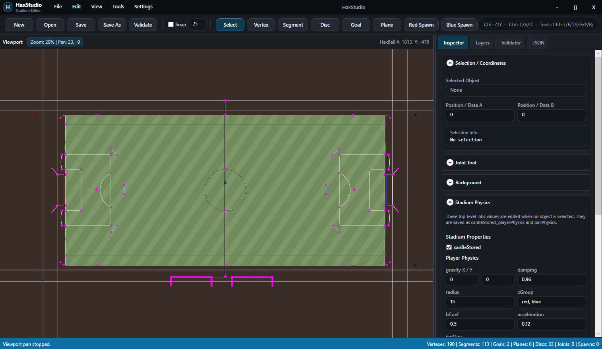

# HaxStudio

A modern HaxBall stadium editor for Browser/Windows.

Create, edit, validate, simulate, and export `.hbs` stadiums with a powerful visual workflow, multiple renderers, image/SVG importing, motion simulation, and advanced mapper tools.

> Current Version: **v1.6.0**
>
> Current Focus: **Bug Fixes**

---

## Preview

---

## Features

### Visual Stadium Editing

* Full visual `.hbs` editing
* Inspector panel
* Layers panel
* Integrated JSON editor
* Multi-object selection

### Movement & Simulation

* Movement Tool
* Slide simulation
* Spin simulation
* Live Play / Pause / Reset preview
* Motion path generation

### Mapping Tools

* Joint Tool
* Text to Segments
* Image to Segments
* SVG Logo Import
* Shape Generator
* Measure Tool

### Rendering

* Canvas
* Direct2D
* OpenGL
* Vulkan

### Export & Validation

* PNG Export
* Stadium Validation
* Cleanup Tools
* Safe Export Workflow

### Languages

* English
* Türkçe
* Español
* Polski

---

## Download

Download the latest release:

https://github.com/xYigit58/HaxStudio/releases/latest

---

## Roadmap

### Current Focus

* 🌐 HaxStudio Web Version
* Cross-platform support
* Browser-based editing
* Existing .hbs compatibility
* Feature parity with desktop

### Future Plans

* Better SVG tracing
* Additional language support
* More mapper tools
* Performance improvements

---

## Community

Discord:

https://discord.gg/3aDwUt88td
